# JAVA_ECLIPSE - Examen 1ev - Proyecto "pilotoPharma"

# 1. Enlace a Trello

https://trello.com/invite/b/eoVxfs1l/0cb81669ae9da048ebb22d7b8e774301/examen-1v-sergio-13-10-2022

# 2. Crear el proyecto y subirlo a GitHub con SourceTree

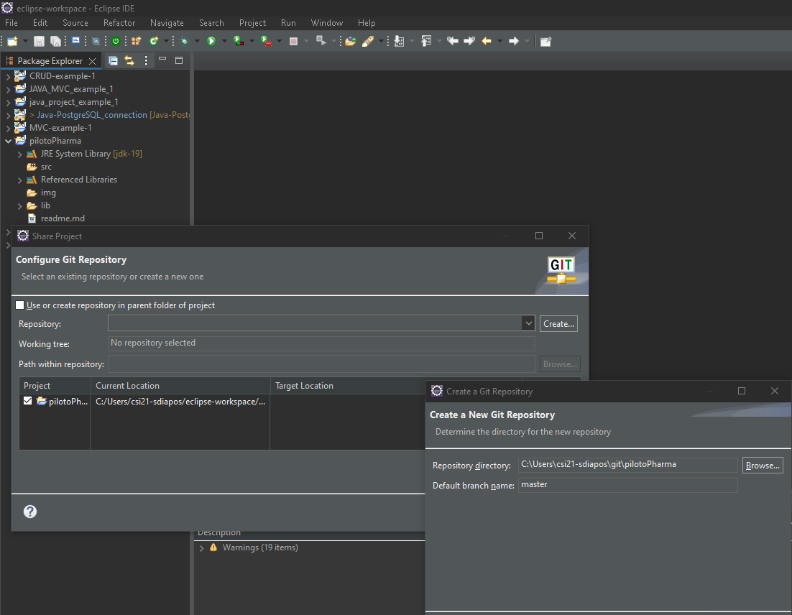

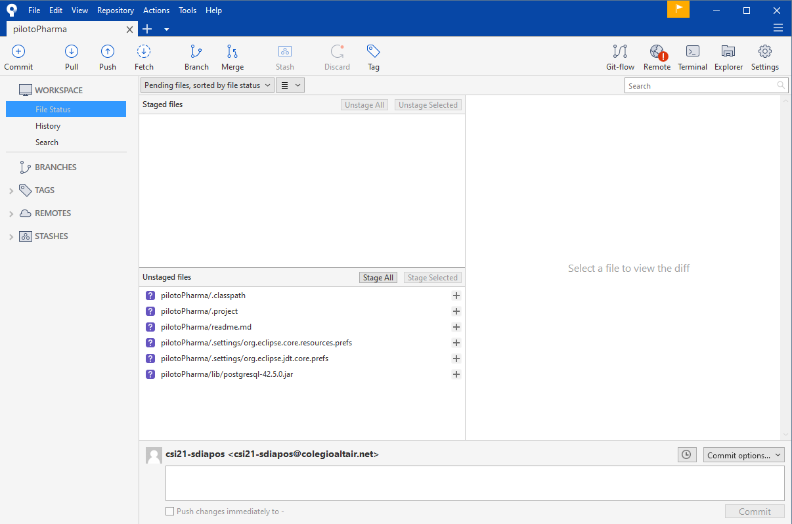

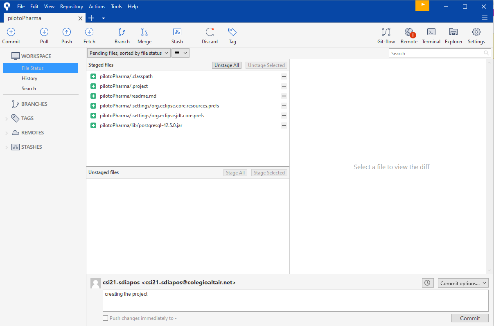

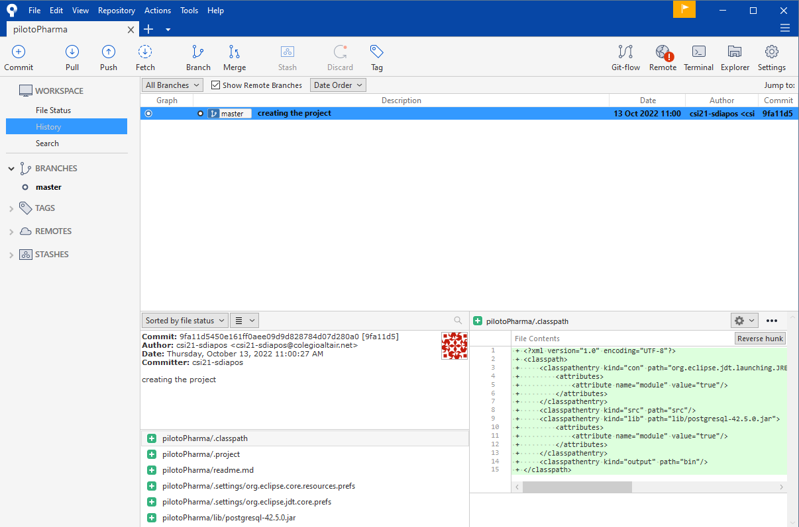

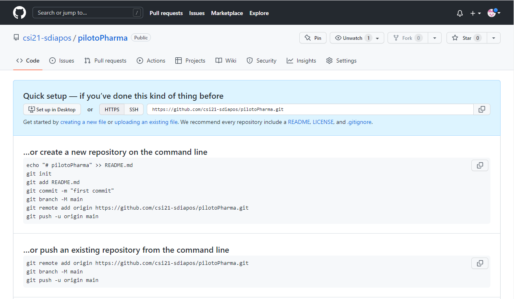

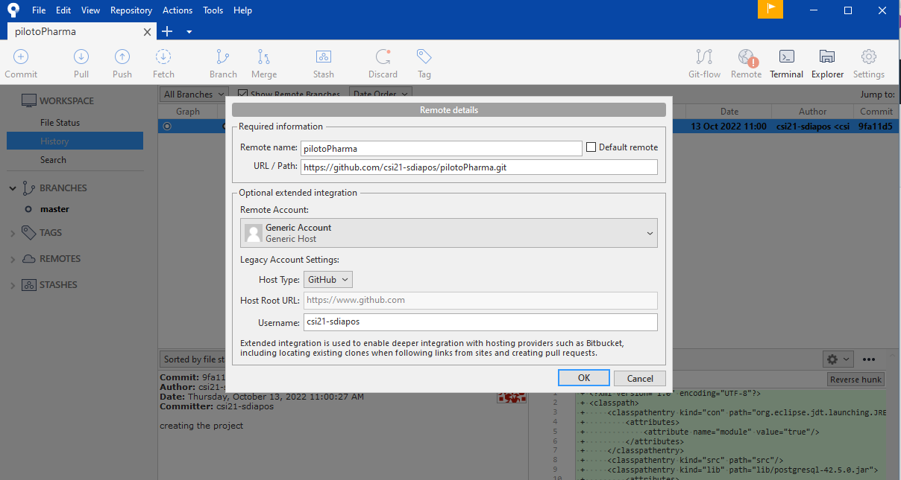

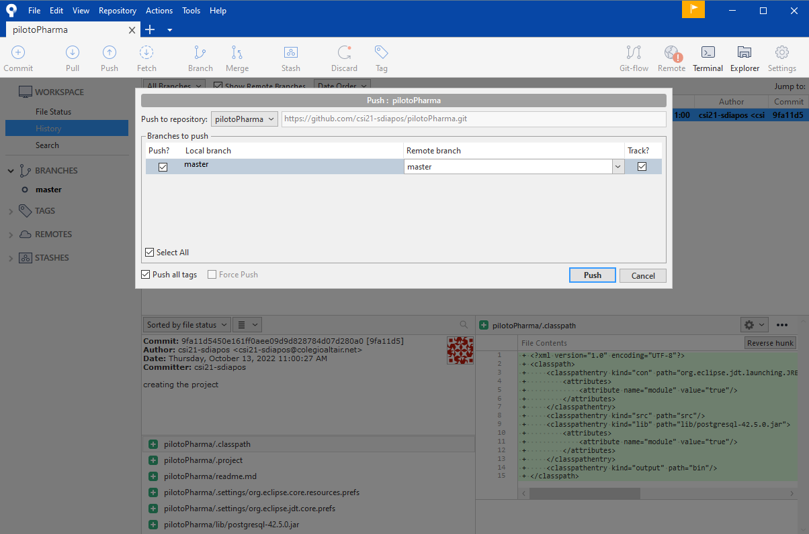

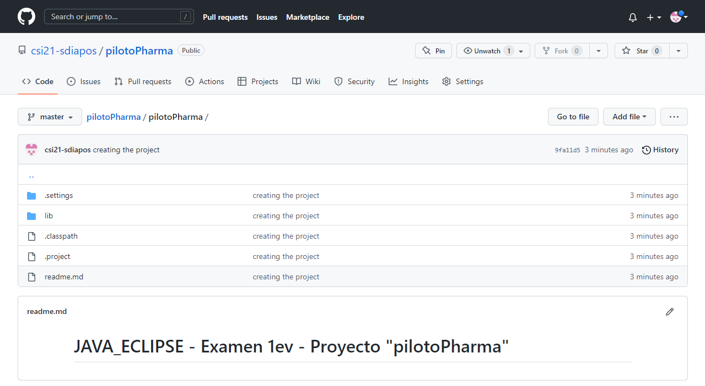

# 3. Crear la BBDD en PostgreSQL

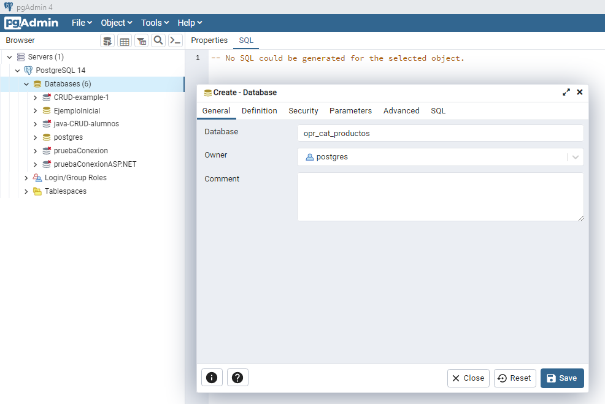

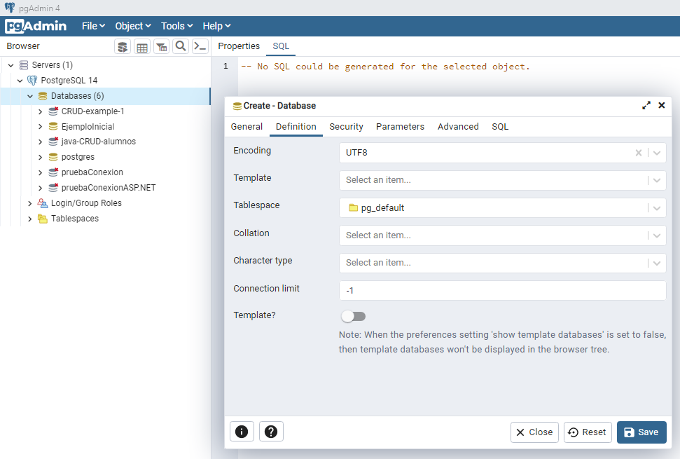

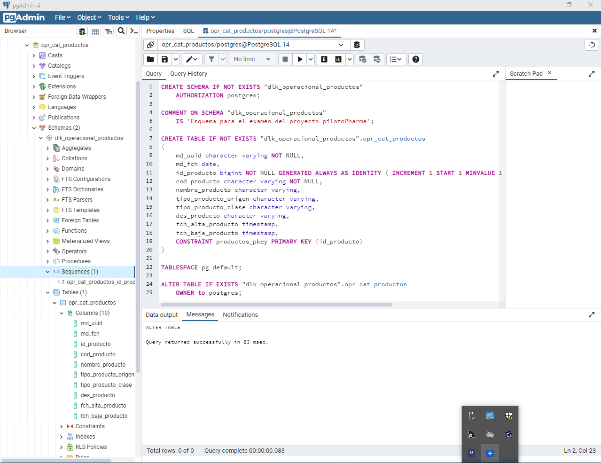

```sql
CREATE SCHEMA IF NOT EXISTS "dlk_operacional_productos" 
	AUTHORIZATION postgres;

COMMENT ON SCHEMA "dlk_operacional_productos" 
	IS 'Esquema para el examen del proyecto pilotoPharma';

CREATE TABLE IF NOT EXISTS "dlk_operacional_productos".opr_cat_productos
(
	md_uuid character varying NOT NULL,
	md_fch date,
    id_producto bigint NOT NULL GENERATED ALWAYS AS IDENTITY ( INCREMENT 1 START 1 MINVALUE 1 MAXVALUE 9223372036854775807 CACHE 1 ),
	cod_producto character varying NOT NULL,
    nombre_producto character varying,
    tipo_producto_origen character varying,
	tipo_producto_clase character varying,
	des_producto character varying,
	fch_alta_producto timestamp,
	fch_baja_producto timestamp,
    CONSTRAINT productos_pkey PRIMARY KEY (id_producto)
)

TABLESPACE pg_default;

ALTER TABLE IF EXISTS "dlk_operacional_productos".opr_cat_productos
    OWNER to postgres;
```

# 4. Estructura interna del proyecto

Hay que crera los siguientes paquetes dentro de *src*:

- Models.Conexiones
- Models.Consultas
- Models.DTOs
- Models.ToDTOs
- Util
- clase Main

# 5. Util --> VariablesConexionPostgreSQL.java

```java
package Util;

public class VariablesConexionPostgreSQL {

	//Datos de conexión a PostgreSQL
		static final String USER = "postgres";
		static final String PASS = "12345";
		static final String PORT = "5432";
		static final String HOST = "localhost";
		static final String DB = "opr_cat_productos";	
		
		public static String getUser() {
			return USER;
		}
		public static String getPass() {
			return PASS;
		}
		public static String getPort() {
			return PORT;
		}
		public static String getHost() {
			return HOST;
		}
		public static String getDb() {
			return DB;
		}
}
```

# 6. Clase ConexionPostgreSQL.java

```java
package Models.Conexiones;

import java.sql.Connection;
import java.sql.DriverManager;

public class ConexionPostgreSQL {

	public Connection generaConexion(final String host, final String port, final String db, final String user, final String pass) {

		System.out.println("\n[INFORMACIÓN-conexionPostgresql-generaConexion] Entra en generaConexion");
		
        Connection conexion = null;
        String url = "jdbc:postgresql://" + host + ":" + port + "/" + db;            
		
        try {
        	
            try {
                Class.forName("org.postgresql.Driver");
            
            } catch (ClassNotFoundException cnfe) {
                System.out.println("\n[ERROR-conexionPostgresql-generaConexion] Error en registro driver PostgreSQL: " + cnfe);
            }
      
            conexion = DriverManager.getConnection(url, user, pass);           
            
            boolean esValida = conexion.isValid(50000);
            
            if(esValida == false) {
            	conexion = null;
            }
            
            System.out.println(esValida ? "\n[INFORMACIÓN-conexionPostgresql-generaConexion] Conexión a PostgreSQL válida" : "[ERROR-conexionPostgresql-generaConexion] Conexión a PostgreSQL no válida");
            
            return conexion;
            
        } catch (java.sql.SQLException jsqle) {
            System.out.println("\n[ERROR-conexionPostgresql-generaConexion] Error en conexión a PostgreSQL (" + url + "): " + jsqle);
            
            return conexion;
        }
	
		
	}
}
```

# 7. CatalogoDTO.java

```java
package Models.DTOs;

import java.sql.Date;
import java.sql.Timestamp;

public class CatalogoDTO {

	// ATRIBUTOS
	String md_uuid; 				// Código de metadato que indica el grupo de inserción al que pertenece el registro.
	Date md_fch; 					// Fecha en la que se define el grupo de inserción.
	int id_producto; 				// Código numérico autoincremental que identifica unívocamente al producto dentro del sistema.
	String cod_producto; 			// Código alfanumérico que identifica unívocamente al producto dentro del catálogo.
	String nombre_producto; 		// Nombre del producto
	String tipo_producto_origen; 	// Laboratorio en el que se desarrolla el producto: “Propio” o “Externo”.
	String tipo_producto_clase; 	// Tipo del producto: “Analgésico”, “Antiséptico”, etc.
	String des_producto; 			// Descripción básica del producto.
	Timestamp fch_alta_producto; 	// Fecha de alta del producto en el catálogo.
	Timestamp fch_baja_producto; 	// Fecha de baja del producto en el catálogo.
	
	
	// CONSTRUCTORES
	
	// constructor lleno
	public CatalogoDTO(String md_uuid, Date md_fch, int id_producto, String cod_producto, String nombre_producto,
			String tipo_producto_origen, String tipo_producto_clase, String des_producto, Timestamp fch_alta_producto,
			Timestamp fch_baja_producto) {
		super();
		this.md_uuid = md_uuid;
		this.md_fch = md_fch;
		this.id_producto = id_producto;
		this.cod_producto = cod_producto;
		this.nombre_producto = nombre_producto;
		this.tipo_producto_origen = tipo_producto_origen;
		this.tipo_producto_clase = tipo_producto_clase;
		this.des_producto = des_producto;
		this.fch_alta_producto = fch_alta_producto;
		this.fch_baja_producto = fch_baja_producto;
	}

	// constructor vacío
	public CatalogoDTO() {
		super();
	}

	
	// GETTERS Y SETTERS
	public String getMd_uuid() {
		return md_uuid;
	}

	public void setMd_uuid(String md_uuid) {
		this.md_uuid = md_uuid;
	}

	public Date getMd_fch() {
		return md_fch;
	}

	public void setMd_fch(Date md_fch) {
		this.md_fch = md_fch;
	}

	public int getId_producto() {
		return id_producto;
	}

	public void setId_producto(int id_producto) {
		this.id_producto = id_producto;
	}

	public String getCod_producto() {
		return cod_producto;
	}

	public void setCod_producto(String cod_producto) {
		this.cod_producto = cod_producto;
	}

	public String getNombre_producto() {
		return nombre_producto;
	}

	public void setNombre_producto(String nombre_producto) {
		this.nombre_producto = nombre_producto;
	}

	public String getTipo_producto_origen() {
		return tipo_producto_origen;
	}

	public void setTipo_producto_origen(String tipo_producto_origen) {
		this.tipo_producto_origen = tipo_producto_origen;
	}

	public String getTipo_producto_clase() {
		return tipo_producto_clase;
	}

	public void setTipo_producto_clase(String tipo_producto_clase) {
		this.tipo_producto_clase = tipo_producto_clase;
	}

	public String getDes_producto() {
		return des_producto;
	}

	public void setDes_producto(String des_producto) {
		this.des_producto = des_producto;
	}

	public Timestamp getFch_alta_producto() {
		return fch_alta_producto;
	}

	public void setFch_alta_producto(Timestamp fch_alta_producto) {
		this.fch_alta_producto = fch_alta_producto;
	}

	public Timestamp getFch_baja_producto() {
		return fch_baja_producto;
	}

	public void setFch_baja_producto(Timestamp fch_baja_producto) {
		this.fch_baja_producto = fch_baja_producto;
	}
	
	
	// ToString
    @Override
    public String toString() {
    	return 
    		"\t" + md_uuid + 
    		"\t" + md_fch +
    		"\t" + id_producto +
    		"\t" + cod_producto +
    		"\t" + nombre_producto +
    		"\t" + tipo_producto_origen +
    		"\t" + tipo_producto_clase +
    		"\t" + des_producto +
    		"\t" + fch_alta_producto +
    		"\t" + fch_baja_producto;
    }
}
```

# 8. PostgreSQLToDTOs.java

```java
package Models.ToDTOs;

import java.sql.ResultSet;
import java.util.ArrayList;
import java.util.List;

import Models.DTOs.CatalogoDTO;

public class PostgreSQLToDTOs {

	public static List<CatalogoDTO> ConsultaSelectCatalogoToDTO(ResultSet resultadoConsulta)
    {
        List<CatalogoDTO> catalogo = new ArrayList<CatalogoDTO>();
		
        try {
        	while (resultadoConsulta.next()) {
    			catalogo.add
    				(
    					new CatalogoDTO
    						(
    								resultadoConsulta.getString("md_uuid"),
    								resultadoConsulta.getDate("md_fch"),
    								resultadoConsulta.getInt("id_producto"),
    								resultadoConsulta.getString("cod_producto"),
    								resultadoConsulta.getString("nombre_producto"),
    								resultadoConsulta.getString("tipo_producto_origen"),
    								resultadoConsulta.getString("tipo_producto_clase"),
    								resultadoConsulta.getString("des_producto"),
    								resultadoConsulta.getTimestamp("fch_alta_producto"),
    								resultadoConsulta.getTimestamp("fch_baja_producto")
    						)					
    				);
    	    }

        } catch (Exception e) {
			// TODO: handle exception
			System.out.println("[ERROR-conexionPostgresql-main] Error generando la declaracionSQL: " + e);
		}
        
        return catalogo;
    }
	
}
```

# 9. ConsultasPostreSQL.java

```java
package Models.Consultas;

import java.util.ArrayList;
import java.util.List;

import Models.Conexiones.ConexionPostgreSQL;
import Models.DTOs.CatalogoDTO;
import Models.ToDTOs.PostgreSQLToDTOs;
import Util.VariablesConexionPostgreSQL;

import java.sql.Connection;
import java.sql.ResultSet;
import java.sql.SQLException;
import java.sql.Statement;

public class ConsultasPostgreSQL {
	
/**************************************** CONSULTAS SELECT *********************************************/
	
    public static List<CatalogoDTO> ConsultaSelectCatalogo(Connection conexionGenerada)
    {
        List<CatalogoDTO> catalogo = new ArrayList<CatalogoDTO>();
        
        // Declaramos el Statement(declaraciónSQL) y el ResultSet(resultadoSQL) y los inicializamos como null
        Statement declaracionSQL = null;
		ResultSet resultadoConsulta = null;
		
		// También declaramos un objeto de nuestra clase ConexionPostgreSQL y lo inicializamos con su constructor vacío
		ConexionPostgreSQL conexionPostgresql = new ConexionPostgreSQL();
		
		// creamos la conexión a nuestra BBDD con el objeto de la clase Connection, y utilizando el método de generaConexion() de nuestra clase ConexionPostgreSQL, el cual nos pedirá los parámetros de conexión...
		conexionGenerada = conexionPostgresql.generaConexion(VariablesConexionPostgreSQL.getHost(),VariablesConexionPostgreSQL.getPort(),VariablesConexionPostgreSQL.getDb(),VariablesConexionPostgreSQL.getUser(),VariablesConexionPostgreSQL.getPass());
		
		System.out.println("\n[INFORMACIÓN-Consultas-ConsultasPostgreSQL.java] Realiza consulta a PostgreSQL");
		
		if(conexionGenerada != null) {
			
			try {
				// Definimos la consulta y la ejecutamos
				declaracionSQL = conexionGenerada.createStatement();
				resultadoConsulta = declaracionSQL.executeQuery("SELECT * FROM \"dlk_operacional_productos\".\"opr_cat_productos\"");
				
				// Recogemos en una lista los datos resultantes de llamar a nuestra consulta 
				catalogo = PostgreSQLToDTOs.ConsultaSelectCatalogoToDTO(resultadoConsulta);

				// Cerramos el resultado y la declaración de la consulta
				System.out.println("\n[INFORMACIÓN-Consultas-ConsultasPostgreSQL.java] Cierre del resultado, de la declaración, y de la conexión");
			    resultadoConsulta.close();
			    declaracionSQL.close();
			    // Cerramos la conexión con la BBDD
			    conexionGenerada.close();
				
			} catch (SQLException e) {
				System.out.println("\n[ERROR-Consultas-ConsultasPostgreSQL.java] Error generando la declaracionSQL: " + e);
			}
		}
		
		return catalogo;
    }

	/*************************************** CONSULTAS INSERTS ******************************************/
    public static void ConsultaInsertCatalogo(Connection conexionGenerada)
    {
        Statement declaracionSQL = null;
		ResultSet resultadoConsulta = null;
		ConexionPostgreSQL conexionPostgresql = new ConexionPostgreSQL();
		
		conexionGenerada = conexionPostgresql.generaConexion(VariablesConexionPostgreSQL.getHost(),VariablesConexionPostgreSQL.getPort(),VariablesConexionPostgreSQL.getDb(),VariablesConexionPostgreSQL.getUser(),VariablesConexionPostgreSQL.getPass());
		
		System.out.println("\n[INFORMACIÓN-Consultas-ConsultasPostgreSQL.java] Realiza consulta a PostgreSQL");
		
		if(conexionGenerada != null) {
			
			try {
				declaracionSQL = conexionGenerada.createStatement();
				resultadoConsulta = declaracionSQL.executeQuery("INSERT INTO \"dlk_operacional_productos\".\"opr_cat_productos\" (md_uuid, md_fch, id_producto, cod_producto, nombre_producto, tipo_producto_origen, tipo_producto_clase, des_producto, fch_alta_producto, fch_baja_producto) VALUES ('111AAA', '2022-10-13', DEFAULT, 'a1', 'RedBull', 'denominacion EEUU', 'denominacion ESP', 'bebida energetica', TIMESTAMP '2022-10-12 13:00:00', TIMESTAMP '2022-10-13 14:00:00')");

				System.out.println("\n[INFORMACIÓN-Consultas-ConsultasPostgreSQL.java] Cierre del resultado, de la declaración, y de la conexión");
				
			    resultadoConsulta.close();
			    declaracionSQL.close();
			    conexionGenerada.close();
				
			} catch (SQLException e) {
				System.out.println("\n[ERROR-Consultas-ConsultasPostgreSQL.java] Error generando la declaracionSQL: " + e);
			}
		}
		
    }
}
```

# 10. Default Package --> Main.java

```java
import java.sql.Connection;
import java.util.ArrayList;
import java.util.List;

import Models.Consultas.ConsultasPostgreSQL;
import Models.DTOs.CatalogoDTO;

public class Main {

	public static void main(String[] args) {
		// TODO Auto-generated method stub

		// Lo primero de todo será declarar un objeto de la clase Connection de java.sql. e inicializarlo como nulo (ya que esta clase no tiene un constructor vacío y no se puede dejar sólo declarado)
		Connection conexionGenerada = null; // este objeto será el que iremos pasando como parámetro a los métodos de consultas
				
		/****************** Obtener y mostrar la tabla "opr_cat_productos" de la BBDD *******************/
				
		List<CatalogoDTO> catalogo = new ArrayList<CatalogoDTO>();

		catalogo = ConsultasPostgreSQL.ConsultaSelectCatalogo(conexionGenerada);

		System.out.println("\n\n\tMd uuId\tMd Fecha\tID Producto\tCod Producto\tNom. Producto\tTipo Origen\t Tipo Clase\tDes. Producto\tFecha Alta\tFecha Baja");
		System.out.println("\t-------------------------------------------------------------------------------------------------");

		for(CatalogoDTO c : catalogo) {
			System.out.println(c.toString());
		}
		
		/************************* Hacemos un insert de un catálogo *********************/
        
        ConsultasPostgreSQL.ConsultaInsertCatalogo(conexionGenerada);
        
        /****************** Volvemos a obtener y mostrar la tabla "opr_cat_productos" de la BBDD *******************/
		
        catalogo = new ArrayList<CatalogoDTO>();

		catalogo = ConsultasPostgreSQL.ConsultaSelectCatalogo(conexionGenerada);

		System.out.println("\n\n\tMd uuId\tMd Fecha\tID Producto\tCod Producto\tNom. Producto\tTipo Origen\t Tipo Clase\tDes. Producto\tFecha Alta\tFecha Baja");
		System.out.println("\t-------------------------------------------------------------------------------------------------");

		for(CatalogoDTO c : catalogo) {
			System.out.println(c.toString());
		}
        
	}

}
```

# 11. Ejecución del proyecto (run as java application)

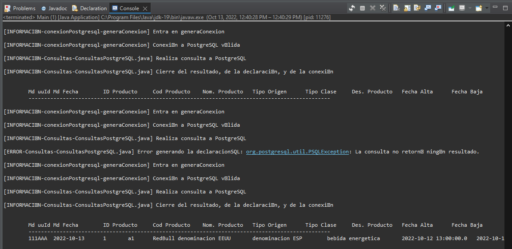

[INFORMACIÓN-conexionPostgresql-generaConexion] Entra en generaConexion

[INFORMACIÓN-conexionPostgresql-generaConexion] Conexión a PostgreSQL válida

[INFORMACIÓN-Consultas-ConsultasPostgreSQL.java] Realiza consulta a PostgreSQL

[INFORMACIÓN-Consultas-ConsultasPostgreSQL.java] Cierre del resultado, de la declaración, y de la conexión


	Md uuId	Md Fecha	ID Producto	Cod Producto	Nom. Producto	Tipo Origen	 Tipo Clase	Des. Producto	Fecha Alta	Fecha Baja
	-------------------------------------------------------------------------------------------------

[INFORMACIÓN-conexionPostgresql-generaConexion] Entra en generaConexion

[INFORMACIÓN-conexionPostgresql-generaConexion] Conexión a PostgreSQL válida

[INFORMACIÓN-Consultas-ConsultasPostgreSQL.java] Realiza consulta a PostgreSQL

[ERROR-Consultas-ConsultasPostgreSQL.java] Error generando la declaracionSQL: org.postgresql.util.PSQLException: La consulta no retornó ningún resultado.

[INFORMACIÓN-conexionPostgresql-generaConexion] Entra en generaConexion

[INFORMACIÓN-conexionPostgresql-generaConexion] Conexión a PostgreSQL válida

[INFORMACIÓN-Consultas-ConsultasPostgreSQL.java] Realiza consulta a PostgreSQL

[INFORMACIÓN-Consultas-ConsultasPostgreSQL.java] Cierre del resultado, de la declaración, y de la conexión


	Md uuId	Md Fecha	ID Producto	Cod Producto	Nom. Producto	Tipo Origen	 Tipo Clase	Des. Producto	Fecha Alta	Fecha Baja
	-------------------------------------------------------------------------------------------------
	111AAA	2022-10-13	1	a1	RedBull	denominacion EEUU	denominacion ESP	bebida energetica	2022-10-12 13:00:00.0	2022-10-13 14:00:00.0

**Nota**: Aunque uno de mis *syso* me informa de que en la consulta del insert, el flujo de ejecición llega a entrar en el catch... el insert se realiza satisfactoriamente, y se aprecia acto seguido en la ultima consulta select.

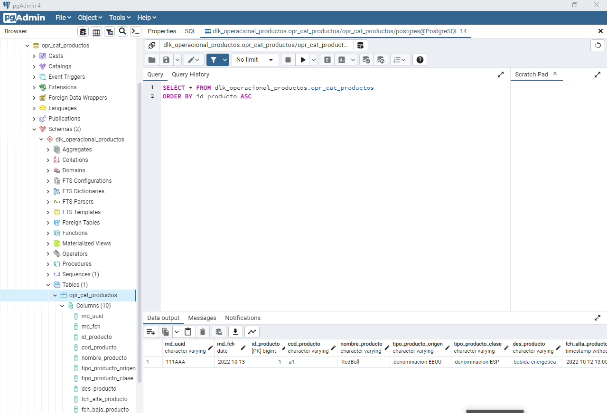